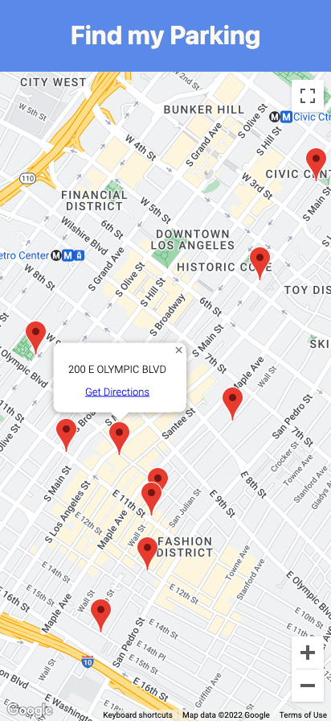

A simple UI for use with the **iot-rest-api**.

## Run Locally in Dev Mode

Pre-requisites:

* An instance of the **postgresql** container running.
* An instance of the **iot-rest-api** running.
* Node.js v16.x.

```bash
# Install deps
npm install

# Start a dev server pointing to the URL of the iot-rest-api
API_URL=http://localhost:8080 npm run dev
```

Open [http://localhost:3000](http://localhost:3000) with your browser to see the result.


