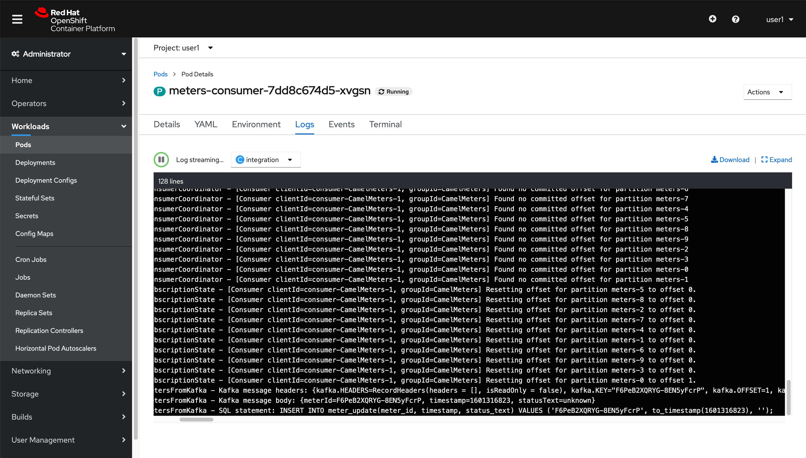
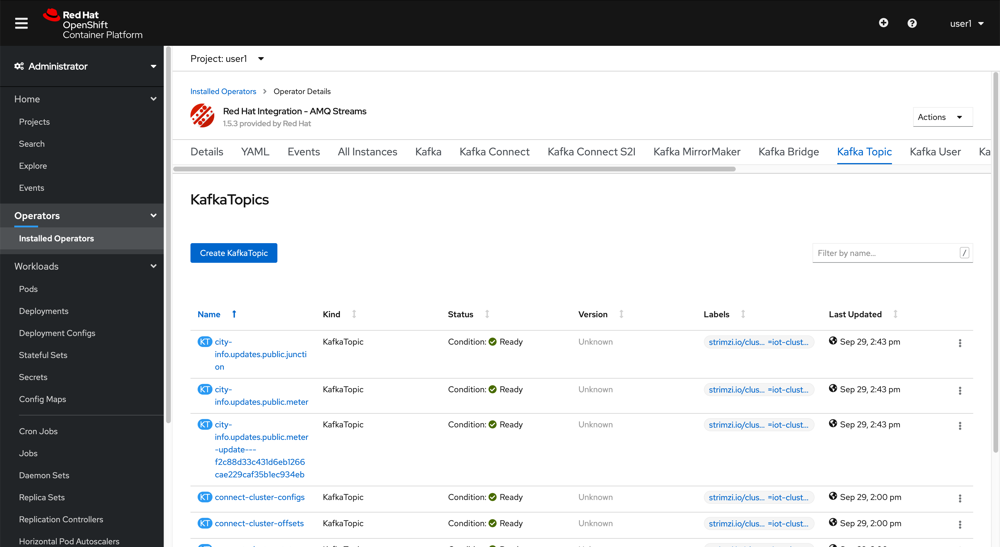

:standard-fail-text: Verify that you followed all the steps. If you continue to have issues, contact a workshop assistant.
:namespace: {user-username}

// Shared service URLS
:codeready-url: http://che-che.{openshift-app-host}/
:3scale-url: http://3scale-admin.{openshift-app-host}/

// Che workspace variables
:che-project-name: KafkaIoT

// User specific URLS
:user-topology-url: {openshift-host}/topology/ns/{namespace}

// Kafka HTTP Bridge URL
:kafka-bridge-service-url: http://iot-cluster-kafka-bridge-service.{namespace}:8080

// 3scale parking meters kafka bridge properties
:3scale-kafka-base-name: kafka-service
:3scale-kafka-api-name: {3scale-kafka-base-name}-api
:3scale-kafka-app-name: {3scale-kafka-base-name}-app
:3scale-kafka-backend-name: {3scale-kafka-base-name}-api-backend
:3scale-kafka-plan-name: {3scale-kafka-base-name}-plan
:3scale-kafka-staging-api-host: https://{user-username}-kafka-api-staging.{openshift-app-host}:443

= Red Hat Tech Ready 2020 IoT Lab

Welcome to the Red Hat Tech Ready 2020 Integration Lab.

In this lab you’ll build out a real-time IoT parking meter management solution for the city of Los Angeles using:

* OpenShift 4
* Red Hat AMQ Streams
* Red Hat 3scale API Management
* Red Hat Fuse (Apache Camel K)
* Red Hat Runtimes
    * Quarkus
    * Node.js

{blank}

The end result will be a mobile application that enables a field worker to view updates to the city's parking meter network in real-time. 

You're assigned the following tasks:

* Create an AMQ Streams Kafka Cluster and Kafka Topic(s).
* Create an AMQ Streams Kafka HTTP Bridge interface to ingest IoT data from parking meters.
* Secure the Kafka HTTP Bridge using 3scale API Management.
* Send meter data to the 3scale endpoint (an IoT device simulator and cURL commands are supplied to help with this)
* Deploy a CamelK integration that inserts IoT data into a pre-configured Postgres database.
* Create AMQ Streams Kafka Connect and Kafka Connector instance, so Debezium CDC can propagate Postgres database events to services connected to relevant Kafka Topic(s).
* Process the CDC events using Kafka Streams to create an event stream for a field workforce mobile application.
* Deploy a Quarkus application that exposes the the Kafka Streams events using server-sent events.
* View the real-time data on a pre-configured mobile application.

{blank}

The final architecture will resemble this:

{blank}

That sure seems like a lot of work, but don't worry we'll be guiding you every step of the way. Click the button below when you're ready to get started!

[type=walkthroughResource,serviceName=openshift]
.Red Hat OpenShift
****
* link:{openshift-host}[Console, window="_blank"]
* link:https://help.openshift.com/[Openshift Online Help Center, window="_blank"]
* link:https://blog.openshift.com/[Openshift Blog, window="_blank"]
****

[type=walkthroughResource,serviceName=3scale]
.3Scale
****
* link:{3scale-kafka-url}[Console, window="_blank"]
* link:https://access.redhat.com/documentation/en-us/red_hat_3scale_api_management/2.7/[Documentation, window="_blank"]
* link:https://www.redhat.com/en/technologies/jboss-middleware/3scale[Overview, window="_blank"]
****

[type=walkthroughResource,serviceName=codeready]
.CodeReady Workspaces
****
* link:{che-url}[Console, window="_blank"]
* link:https://developers.redhat.com/products/codeready-workspaces/overview/[Overview, window="_blank"]
* link:https://access.redhat.com/documentation/en-us/red_hat_codeready_workspaces/2.0/[Documentation, window="_blank"]
****

[time=10]
== CodeReady Workspaces Preparation and Project Introduction

You will be using Red Hat CodeReady Workspaces, an online integrated development environment (IDE) based on Eclipse, as your development environment. We've pre-loaded the environment with all the tools you'll need throughout this lab.

[NOTE]
====
In CodeReady Workspaces changes to files are auto-saved every few seconds, so you don’t need to explicitly save changes.
====

=== Login to CodeReady Workspaces

. To get started go to the link:{codeready-url}[CodeReady console, window="_blank"] and log in using your username and password credentials.
. You will need to _Authorize Access_ so CodeReady can access your permissions and manage your session. Click on *Allow selected permissions*.

=== Start a CodeReady workspace

. Once you have logged in and authorized access to your user account, you will land in your personal CodeReady dashboard. 
. Click on the workspace with the name starting with `integration-iot-lab-` on the left menu bar under *RECENT WORKSPACES*.
. This will start an instance of the workspace. Please wait a few moments while it downloads the required container images and configuration setup.
. The first time it’s run, it will git clone the required projects for this workshop. After a minute or two, you’ll be placed in the workspace. Close the initial welcome and README tabs then click on the Explorer button on the left side bar.

[NOTE]
====
This IDE is based on *Eclipse Che*, which is in turn is based on Microsoft VS Code editor. It will look familiar if you have already used it.

You can close the _Problems_ and _Output_ views to clear space.
====

. The projects explorer will show you a folder with the required projects. Expand the folders to reveal the projects we cloned from a git repository.
. During the workshop we will need to introduce commands for both the OpenShift and other Command Line Interfaces (CLI) tools. For that we will need to start a terminal window _inside_ one of the containers from the developer workspace. To open the terminal window, click on the _My Workspace_ button on the right side panel and expand the **User Runtimes/tools** folder. Click on *>_ New terminal*.
. This will deploy the terminal window in the bottom of the screen. This terminal is attached to the running CodeReady container and is also running on OpenShift. This is the place where you will issue most of the commands from this workshop.

=== Login into the OpenShift cluster via the CLI

. Finally, you will need to login into the OpenShift CLI to start interacting with the platform. For login, issue the following command:
+
[source,bash,subs="attributes+"]
----
oc login -u {user-username} -p {user-password} https://$KUBERNETES_SERVICE_HOST:$KUBERNETES_SERVICE_PORT --insecure-skip-tls-verify=true
----

. You should see something like the following (the project names may be different):
+
----
Login successful.

You have access to the following projects and can switch between them with 'oc project <projectname>':

  * user1
    user1-che
    user1-rhtr-0605
    user1-shared-475f
----

. Most of the work will be deploy to your own `{namespace}` project namespace, so be sure to have it as a _working_ project by executing the following command:
+
[source,bash,subs="attributes+"]
----
oc project {namespace}
----
. Use the image below as a reference to verify your Che workspace is valid.

image:images/screenshots/08-che-setup.png[Che Workspace Setup]

{blank}

[type=verification]
Were you able to view the Che workspace and login using the `oc login` command in the terminal?

[type=verificationFail]
{standard-fail-text}

=== View the Project Topology and UI

Some services for this lab were provisioned ahead of time to provide a streamlined lab experience. View these by following these instructions:

. Login to the link:{openshift-host}/topology/ns/{namespace}/graph[OpenShift Console, window="_blank"] to view the *{namespace}* project.
. The Topology view should look similar to this screenshot.
+

. The services displayed are as follows:
    * A Postgres database containing reference data for Parking Meters and Traffic Junctions. This database has the necessary Debezium CDC extensions configured.
    * A GraphQL API built using Node.js and link:https://graphback.dev[Graphback, window="_blank"]. This provides access to Meter and Junction data stored in Postgres.
    * An NGINX container that serves a web application built using React.
. Click on the NGINX node in the Topology View.
. Select the the *Resources* tab, and click the URL listed under *Routes*. It will look similar to `https://sensor-management-ui-{namespace}.apps.$CLUSTER_URL`.
. The link should render a web application with a title *LA Department of Transport* similar to the one shown below.
+

[NOTE]
====
This lab and the web application displayed _are not affiliated with_ the City of Los Angeles. The lab _does_ use data scraped from link:https://geohub.lacity.org/datasets/traffic-data[City of Los Angeles APIs, window="_blank"].
====

. Click the *Meters* link in the navigation bar at the top of the application. A list of meters should be displayed.
. The previous step verifies that the Node.js GraphQL API is communicating with the Postgres database.
. Enter `santa monica` into the search field and press Enter or click the blue Search button. Parking Meters from Santa Monica Blvd are listed.
. Select the first item on the list. A details screen for that Parking Meter should be displayed.
+

{blank}

[type=verification]
Were you able to view the Meters list in the web application? If so, you are ready to start working on the next set of tasks.

[type=verificationFail]
{standard-fail-text}

[time=15]
== Setup a Kafka Cluster, Topics, and HTTP Bridge

The OpenShift 4 cluster that this lab is being run on has been pre-configured with the *Red Hat Integration - AMQ Streams* operator. Documentation for AMQ Streams on OpenShift can be found at link:{https://access.redhat.com/documentation/en-us/red_hat_amq/7.7/html-single/using_amq_streams_on_openshift/index}[this link, window="_blank"].

=== Create the Kafka Cluster 
A Kafka Cluster is created by providing OpenShift with an instance of a *Kafka* link:{https://docs.openshift.com/container-platform/4.5/operators/crds/crd-extending-api-with-crds.html#crd-creating-custom-resources-from-file_crd-extending-api-with-crds}[Custom Resource, window="_blank"] via the `oc apply` command. The AMQ Streams operator will create the Kafka Cluster based on the parameters specified in the CR.

. Open the OpenShift Developer Console link:{user-topology-url}[Topology View, window="_blank"].
. Click *+Add* on the left menu.
. Click on the *From Catalog* option.
. Type in `kafka` in the search text field. You should see a list of Kafka resources that are provided by the operator.
+

. Click on the *Kafka* item, review the details, then click the *Create* button.
. Create a `Kafka` Custom Resource to define your connector. Replace the contents of the _YAML_ editor with the following code:
+
[source,yaml,subs="attributes+"]
----
apiVersion: kafka.strimzi.io/v1beta1
kind: Kafka
metadata:
  name: iot-cluster
spec:
  kafka:
    version: 2.5.0
    replicas: 3
    listeners:
      plain: {}
      tls: {}
    config:
      offsets.topic.replication.factor: 3
      transaction.state.log.replication.factor: 3
      transaction.state.log.min.isr: 2
      log.message.format.version: '2.5'
    storage:
      type: ephemeral
  zookeeper:
    replicas: 3
    storage:
      type: ephemeral
  entityOperator:
    topicOperator: {}
    userOperator: {}
----
. Click the *Create* button. You should be returned to the link:{user-topology-url}[Topology View, window="_blank"] automatically.

{blank}

After a few moments the Kafka Cluster will be displayed. It is represented in the Topology View as a application group named *strimzi-iot-cluster*.

=== Create a Topic for Parking Meter Data Ingestion

. Open the OpenShift Developer Console link:{user-topology-url}[Topology View, window="_blank"].
. Click *+Add* on the left menu.
. Click on the *From Catalog* option.
. Type in `kafka` in the search text field and then click on *Kafka Topic*.
. Click the *Create* button.
. Create a `Kafka Topic` Custom Resource to define your connector. Replace the contents of the _YAML_ editor with the following code:
+
[source,yaml,subs="attributes+"]
----
apiVersion: kafka.strimzi.io/v1beta1
kind: KafkaTopic
metadata:
  name: meters
  labels:
    strimzi.io/cluster: iot-cluster
spec:
  partitions: 10
  replicas: 1
  config:
    retention.ms: 604800000
    segment.bytes: 1073741824
----
. Click the *Create* button.

{blank}

The AMQ Streams operator will automatically create the Topic in the Kafka Cluster shortly after you submit the CR YAML.

=== Create the HTTP Bridge for Data Ingestion

Now that a topic has been created, you'll want to start placing data into it! This can be achieved by deploying an application that acts as a Producer and writes messages to a Topic. 

The included *iot-data-generator* is a Producer, but you won't be using it just yet. First, you'll deploy a Kafka Bridge that exposes a HTTP endpoint so we can send messages to the *meters* Topic via HTTP.

. Open the OpenShift Developer Console link:{user-topology-url}[Topology View, window="_blank"].
. Click *+Add* on the left menu.
. Click on the *From Catalog* option.
. Type in `kafka` in the search text field and then click on *Kafka Topic*.
. Click the *Create* button.
. Create a `Kafka Bridge` Custom Resource to define your connector. Replace the contents of the _YAML_ editor with the following code:
+
[source,yaml,subs="attributes+"]
----
apiVersion: kafka.strimzi.io/v1alpha1
kind: KafkaBridge
metadata:
  name: iot-cluster-kafka
spec:
  tls:
    trustedCertificates:
      - secretName: iot-cluster-cluster-ca-cert
        certificate: ca.crt
  bootstrapServers: 'iot-cluster-kafka-bootstrap:9093'
  http:
    port: 8080
  replicas: 1
----
. Click the *Create* button.

{blank}

The Kafka Bridge should and appear in the Project link:{user-topology-url}[Topology View, window="_blank"] within a few seconds.

=== Verify the Cluster, Topics, and Bridge

Now that the bridge has been created, you can use it place data into the *meters* Topic. By default, the Kafka HTTP Bridge is does not expose an OpenShift Route so it cannot be accessed from outside the cluster. Sending a POST request using cURL from the terminal in CodeReady Workspaces will work, since it is running within the OpenShift cluster and can access other services running in the cluster.

. Navigate to the link:{codeready-url}[CodeReady console, window="_blank"]. Log in using your username and password credentials, and open your workspace.
. To open the terminal window, click on the _My Workspace_ button on the right side panel and expand the **User Runtimes/tools** folder. Click on *>_ New terminal*.
. To find the hostname of the Kafka HTTP Bridge run the `oc get svc -n {namespace}` command. It should list the `iot-cluster-kafka-bridge-service` and the port it is listening on.
. Run a `date +%s` command to get a valid timestamp for the request payload.
. From the terminal, run the following command to place a message into the *meters* Topic. Replace the `timestamp` value with the output from the previous `date` command:
+
[source,bash,subs="attributes+"]
----
curl -X POST \
{kafka-bridge-service-url}/topics/meters \
-H 'content-type: application/vnd.kafka.json.v2+json' \
-d '{
  "records": [
      {
        "key": "F6PeB2XQRYG-8EN5yFcrP",
        "value": {"meterId":"F6PeB2XQRYG-8EN5yFcrP","timestamp":1601316823,"status":"unknown"}
      }
  ]
}'
----
. A successful response will look similar to this JSON: `{"offsets":[{"partition":1,"offset":0}]}`

[type=verification]
Did you receive a JSON response from the Kafka HTTP Bridge that is similar to the provided example?

[type=verificationFail]
{standard-fail-text}

[time=15]
== Secure the Kafka HTTP Bridge using 3scale API Management

In the previous section you created a Kafka Bridge to provide HTTP access to the Kafka Cluster and Topics. The Kafka Bridge HTTP endpoint was not exposed using an OpenShift Route since this would enable anyone that discovered the URL to access it.

To secure and expose the Kafka HTTP Bridge using 3scale API Management you will perform the following tasks in 3scale API Management:

* Create a new *Product* and *Backend*.
* Create an *Application Plan*.
* Create an *Application*.
* Configure the API Settings.
* Promote the API to a staging environment.

{blank}

Here's a quick overview of those terms:

* A *Product* defines the developer/consumer facing end service you wish to make available for consumption.
* A *Backend* defines the backend service(s) you wish to protect and make available via a *Product*.
* An *Applications* define the credentials (e.g. API Key) to access your API. Applications are stored within *Developer Accounts*.
* An *Application Plan* determines the access policies and is always associated with one *Application*.

=== API Management Login

. Open the link:{3scale-kafka-url}[3scale Login Page, window="_blank"] and log in with your username and password.
. The main Dashboard should be displayed.

{blank}

[type=verification]
Can you see the 3scale API Management dashboard and navigate the main menu?

[type=verificationFail]
{standard-fail-text}

=== Creating a New Product

. From the *Dashboard*, select the *New Product* item.
. Select the *Define Manually* option.
. Enter the following as the *Name* and *System name*:
+
[subs="attributes+"]
----
{3scale-kafka-api-name}
----
. Leave the *Description* field empty.
. Click *Create Product* at the bottom of the screen.

{blank}

=== Creating an Application Plan
. Verify that *Product: {3scale-kafka-api-name}* is selected in the top navigation menu of 3scale API Management.
. Select *Applications > Application Plans* from the side navigation.
. Click *Create Application Plan* on the right side of the screen.
. Enter the following for *Name* and *System name*:
+
[subs="attributes+"]
----
{3scale-kafka-plan-name}
----
. Leave the other fields with their default values.
. Select *Create Application Plan*. You will be redirected to the *Application Plans* screen.
. Select the *Publish* link, beside your plan list item, to publish the Plan.

{blank}

=== Creating an Application
. Select *Audience* from the top navigation bar dropdown.
. Select the *Developer* Account to open the *Account Summary* page.
. Select the *(num) Application* item from the breadcrumb at the top of the screen to view Applications.
. Click the *Create Application* button in the top right.
. Select the *{3scale-kafka-plan-name}* Plan within the *{3scale-kafka-api-name}* section in the *Application plan* dropdown.
. Enter the following for *Name* and *Description*:
+
[subs="attributes+"]
----
{3scale-kafka-app-name}
----
. Click *Create Application*.

=== Creating a Backend

A *Backend* defines the backend service(s) you wish to protect and make available via *Product(s)*. This includes rules whitelisting HTTP verbs and paths.

. Verify that *Dashboard* is selected in the top navigation menu of 3scale API Management.
. Select *Backends* from the *APIs* section.
. Click the *New Backend* link.
. Enter following in the *Name* and *System name* fields:
+
[subs="attributes+"]
----
{3scale-kafka-backend-name}
----
. In the *Private endpoint* field, enter the following URL:
+
[subs="attributes+"]
----
{kafka-bridge-service-url}
----
{blank}

. Click *Create Backend*.
. Verify that *Backend: {3scale-kafka-backend-name}* is selected in the top navigation menu of 3scale API Management.
. Select *Mapping Rules* from the side navigation.
. Click *Add Mapping Rule* on the *Mapping Rules* screen to create a mapping rule:
.. Select *POST* for the *Verb*.
.. Enter */topics/meters* in the *Pattern* field.
.. Leave the other fields with their default values.
.. Click *Create Mapping* rule.

=== Configure and Deploy the API to Staging

In this section you'll see how the resources created in previous sections are utilised to access the API.

. Ensure that the *{3scale-kafka-api-name}* Product is selected in the top navigation menu of {3Scale-kafka-ProductName}.
. Select *Integration > Settings*:
.. In the *Staging Public Base URL* field enter `{3scale-kafka-staging-api-host}`.
.. Scroll down and click the *Update Product* button.
. Select *Integration > Configuration* from the side menu and click *add a Backend and promote this configuration*.
. In the *Add Backend* screen select your *{3scale-kafka-backend-name}* in the *Backend* field and click *Add to Product*.
. Return to the *Integration > Configuration* section and click *Promote v. 1 to Staging* button.
. The *Environments* section in *Integration > Configuration* should now contain the *Staging Environment* details. Under *Example curl for testing* you will find the *user_key*, i.e the API Key required to authenticate HTTP requests to the endpoint.

{blank}

[NOTE]
====
Take special note of the API Key in the `user_key` from the *Example curl for testing*. You'll need it in the next section.
====

=== Verify the API Endpoint

. Navigate to the link:{codeready-url}[CodeReady console, window="_blank"]. Log in using your username and password credentials, and open your workspace.
. To open the terminal window, click on the _My Workspace_ button on the right side panel and expand the **User Runtimes/tools** folder. Click on *>_ New terminal*.
. Run a `date +%s` command to get a valid timestamp for the request payload.
. From the terminal, run the following command to place a message into the *meters* Topic. Replace the `timestamp` value with the output from the previous `date` command:
+
[source,bash,subs="attributes+"]
----
curl -X POST \
{3scale-kafka-staging-api-host}/topics/meters?user_key=YOUR_KEY_HERE \
-H 'content-type: application/vnd.kafka.json.v2+json' \
-d '{
  "records": [
      {
        "key": "F6PeB2XQRYG-8EN5yFcrP",
        "value": {"meterId":"F6PeB2XQRYG-8EN5yFcrP","timestamp":1600959192,"status":"unknown"}
      }
  ]
}'
----
. A successful response will look similar to this JSON: `{"offsets":[{"partition":1,"offset":0}]}`

[type=verification]
Were you able to send a payload to the Kafka Topic via the 3scale API Management endpoint?

[type=verificationFail]
Ensure that the API Key (`user_key`) is defined in the sample Staging cURL command and that you entered the correct URL in the Backend configuration. {standard-fail-text}

[time=15]
== Deploying a CamelK Integration to Process Topics

At this point you've setup Kafka infrastructure and API Management capabilities to ingest data from IoT devices (Producers). Next, you need to process that data using a Consumer.

In this section you'll deploy a Consumer that processes the Parking Meter events using CamelK. This Consumer writes the data to the Postgres database for long-term storage.

=== Deployment using the Kamel CLI
. Navigate to the link:{codeready-url}[CodeReady console, window="_blank"]. Log in using your username and password credentials, and open your workspace.
. Select Terminal > Open Terminal in specific container and select the container that begins with "dil-" (followed by a 5-digit alphanumeric code). Click it and a terminal window should open.
+

. Verify you have a terminal session in the correct container by running the `kamel --help` command. The help output will be printed if you're in the correct container.
. Login using the following command:
+
[source,bash,subs="attributes+"]
----
oc login -u {user-username} -p {user-password} https://$KUBERNETES_SERVICE_HOST:$KUBERNETES_SERVICE_PORT --insecure-skip-tls-verify=true
----
. Expand the *{che-project-name}/services/camel-iot-ingestion* folder, and open the *meters.properties* file.
. Verify that the *kafka.host* and *kafka.port* values are correct. Do this by running `oc get svc -n {namespace}` and finding the corresponding host and ports in the terminal output. Amend the *meters.properties* file if necessary.
. Verify that the *db.username* and *db.password* are referencing the correct values:
    * Run `oc get secret -n {namespace}` to verify that the *pg-login* secret from the *meters.properties* is listed.
    * Run `oc get secret/pg-login -n {namespace} -o yaml` to verify that the secret contains the keys referenced in *meters.properties*.
. Open the *MetersConsumer.java* file. Note that the `dataSource.setUsername` and `dataSource.setPassword` are being set to the values from the *meters.properties* using the `PropertyInject` annotation.
. Change directory using the `cd {che-project-name}/services/camel-iot-ingestion` command.
. Run the following command to create a ConfigMap to store the *meter.properties* file:
+
[source,bash,subs="attributes+"]
----
oc create configmap meters.kafka.props --from-file=meters.properties
----
. The next command will deploy the *MetersConsumer.java* file that implements this integration. Note that command-line flags:
    * Target the correct namespace.
    * Include a reference to the *pg-login* Secret you verified.
    * Include the ConfigMap that contains the *meters.properties*.
    * Specify required dependencies.
. Use the following `kamel run` command to deploy the integration:
+
[source,bash,subs="attributes+"]
----
kamel run MetersConsumer.java \
-n {namespace} \
--secret pg-login \
--configmap=meters.kafka.props \
--dependency mvn:org.postgresql:postgresql:42.2.10 \
--dependency=camel-jdbc \
--dependency=mvn:org.apache.commons:commons-dbcp2:2.7.0
----

{blank}

The *Red Hat Integration - CamelK* operator will start building your integration after a few moments.

=== Verify the Integration

After you've executed the `kamel run` command, the operator will create a BuildConfig and Build to deploy the integration. Since this is the initial deployment it will take a few minutes to build and start.

You can run the following commands to view the resources created by the *Red Hat Integration - CamelK* operator to deploy and manage the integration:

. Use `oc get bc -n {namespace}` to list BuildConfigs. The list will contain a BuildConfig starting with "camel".
. The `oc get builds` command will return a list of Builds. You will be able to find one starting with "camel", e.g "camel-k-kit-btmvls9ki". View the logs using `oc logs`, e.g `oc logs camel-k-kit-btmvls9ki-builder`.
. You can also view this information by visiting the link:{openshift-host}/k8s/ns/{namespace}/buildconfigs[BuildConfigs, window="_blank"] screen.

Once you're finished exploring these resources, you can monitor the integration:

. Open the OpenShift Developer Console link:{user-topology-url}[Topology View, window="_blank"].
. A new node containing the a *meters-consumer*  Deployment should be shown. If the Deployment is missing, wait a little longer so the operator can finish building it.
+

. Click the CamelK node and a details panel will appear on the right.
. Select the *Resources* tab inb the details panel, then click *View logs*.
. The logs should display generic startup information, and references to the Kafka configuration being used. No errors should be displayed.
. Send a message to the meters topic to verify the integration is working as intended. Use the same cURL command you used previously:
+
[source,bash,subs="attributes+"]
----
curl -X POST \
{3scale-kafka-staging-api-host}/topics/meters?user_key=YOUR_KEY_HERE \
-H 'content-type: application/vnd.kafka.json.v2+json' \
-d '{
  "records": [
      {
        "key": "F6PeB2XQRYG-8EN5yFcrP",
        "value": {"meterId":"F6PeB2XQRYG-8EN5yFcrP","timestamp":1600959192,"status":"unknown"}
      }
  ]
}'
----
. Once the cURL command returns a successful response, return to the integration logs.
+

. Using the screenshot above as a reference, confirm the JSON you sent via cURL is shown as the Kafka message body. An SQL INSERT statement should also be printed. No errors should be displayed.
. Next, you'll verify that the INSERT to the database worked as expected. Get started by opening the OpenShift Developer Console link:{user-topology-url}[Topology View, window="_blank"].
. Select the *iot-psql* node. A details pane should appear on the right. Select the *Resources* tab, and click the Pod name.
. Navigate the *Terminal* tab from the *Pod Details* screen and run the following commands to query the database:
[source,bash,subs="attributes+"]
----
psql -d $POSTGRES_DB -U $POSTGRES_USER

select * from meter_update;
----
. You should see output similar to this screenshot:
+
image:images/screenshots/11-psql-meter-update.png[Postgres Meter Update Table Entries]

{blank}

[type=verification]
Was your JSON processed by the CamelK integration and insterted into the *meter_update* table?

[type=verificationFail]
Did you get a successful response from the 3scale API endpoint? Is the CamelK integration able to connect to the Postgres database? {standard-fail-text}

[time=15]
== Kafka Configuration for Change Data Capture

Now data can flow from IoT devices to Kafka Topics via 3scale API Management. Downstream applications may want to be alerted of the database operations triggered by the integrations you've created.

To facilitate this, you'll setup *change data capture* using Debezium to stream database events to a Kafka Topic via Kafka Connect.

=== Deploy Kafka Connect
. The Postgres instance used in this lab has been pre-configured with the Debezium extensions, so you will configure a Kafka Connect to communicate with it.
. Open the OpenShift Developer Console link:{user-topology-url}[Topology View, window="_blank"].
. Click *+Add* on the left menu.
. Click on the *From Catalog* option.
. Type in `kafka` in the search text field and then click on *Kafka Connect*.
. Click the *Create* button.
. Replace the contents of the editor with the following YAML. This YAML configures the Kafka Connect instance to connect to the Kafka cluster you created earlier. It also uses a pre-built image that contains the *link:https://github.com/debezium/debezium/tree/master/debezium-connector-postgres[Debezium Postgres Connector, window="_blank"]*.
+
[source,yaml,subs="attributes+"]
----
apiVersion: kafka.strimzi.io/v1beta1
kind: KafkaConnect
metadata:
  name: iot-connect-cluster
  annotations:
    strimzi.io/use-connector-resources: "true"
spec:
  version: 2.5.0
  replicas: 1
  bootstrapServers: 'iot-cluster-kafka-bootstrap:9093'
  image: quay.io/evanshortiss/rhtr-2020-kafka-connect-pgsql:latest
  tls:
    trustedCertificates:
      - secretName: iot-cluster-cluster-ca-cert
        certificate: ca.crt
----
. Click *Create*.
. You should see the Kafka Connect instance in the link:{user-topology-url}[Topology View, window="_blank"] after a few seconds.
+
image:images/screenshots/12-kafka-connect-topology.png[Kafka Connect in the Topology View]

=== Create a Kafka Connector

Now that a Kafka Connect instance is running, you need to deploy a Kafka Connector.

. Open the OpenShift Developer Console link:{user-topology-url}[Topology View, window="_blank"].
. Click *+Add* on the left menu.
. Click on the *From Catalog* option.
. Type in `kafka` in the search text field and then click on *Kafka Connector*.
. Click the *Create* button.
. Replace the contents of the editor with the following YAML. This defines a Kafka Connector that will use the Debezium Postgres Connector to create a stream of database events.
+
[source,yaml,subs="attributes+"]
----
apiVersion: kafka.strimzi.io/v1alpha1
kind: KafkaConnector
metadata:
  name: updates-connector
  labels:
    strimzi.io/cluster: iot-connect-cluster
spec:
  class: io.debezium.connector.postgresql.PostgresConnector
  tasksMax: 1
  config:
    connector.class: "io.debezium.connector.postgresql.PostgresConnector"
    database.hostname: "iot-psql"
    database.port: "5432"
    database.user: "rhtr-user"
    database.password: "rhtr-password"
    database.dbname: "city-info"
    database.server.name: "city-info.updates"
    database.whitelist: city-info
    database.history.kafka.bootstrap.servers: "iot-cluster-kafka-bootstrap:9093"
    database.history.kafka.topic: "city-info.updates.dbhistory"
----
. Click *Create* to create the Connector.
. Select the Kafka Connect node (*iot-connect-cluster-connect*) on the link:{user-topology-url}[Topology View, window="_blank"], and select the Pod listed on the *Resources* tab.
. Navigate to the *Logs* tab on the *Pod Details* screen.
. Verify that a connection to Postgres was established by searching for `INFO user 'rhtr-user' connected to database 'city-info' on PostgreSQL`. The logs should look similar to the screenshot below.  
+

[type=verification]
Do the Kafka Connect logs report that the Postgres Connector successfully connected to the Postgres instance?

[type=verificationFail]
{standard-fail-text}

=== Send a Message to the Meters Topic

To verify the Connector is working as expected you'll want to send a new message to be processed. This will trigger an INSERT to the *meter_update* table that Debezium will capture.

. Navigate to the link:{codeready-url}[CodeReady console, window="_blank"]. Log in using your username and password credentials, and open your workspace.
. To open the terminal window, click on the _My Workspace_ button on the right side panel and expand the **User Runtimes/tools** folder. Click on *>_ New terminal*.
. Run a `date +%s` command to get a valid timestamp for the request payload.
. From the terminal, run the following command to place a message into the *meters* Topic. Replace the `timestamp` value with the output from the previous `date` command:
+
[source,bash,subs="attributes+"]
----
curl -X POST \
{3scale-kafka-staging-api-host}/topics/meters?user_key=YOUR_KEY_HERE \
-H 'content-type: application/vnd.kafka.json.v2+json' \
-d '{
  "records": [
      {
        "key": "F6PeB2XQRYG-8EN5yFcrP",
        "value": {"meterId":"F6PeB2XQRYG-8EN5yFcrP","timestamp":1600959192,"status":"unknown"}
      }
  ]
}'
----
. A successful response will look similar to this JSON: `{"offsets":[{"partition":1,"offset":0}]}`

=== Examine the Kafka Topics Listing

. Navigate to the link:{openshift-host}/k8s/cluster/projects/{namespace}[Administrator View] for your project.
. Expand the *Operators* section on the left and select *Installed Operators*.
. Select the *Red Hat Integration - AMQ Streams* operator. This will display the *Operator Details* screen.
. Navigate to the *Kafka Topic* tab. You should see the *meters* Topic you created using YAML earlier in this lab, but you should also see Topics with the prefix *city-info.updates*.
+

. Click the Topic that starts with *city-info.updates.public.meter-update*, and is followed by a unique ID. This will load the *KafkaTopic Details* screen.
. Switch to the *YAML* tab and find the `topicName` field in the YAML. It should have the value `city-info.updates.public.meter_update`. Take note of this since it is required in the next section.

{blank}

[type=verification]
Does the Topics list contain items prefixed with *city-info.updates*, e.g *city-info.updates.public.meter-update---$UNIQUE_ID*?

[type=verificationFail]
{standard-fail-text}

=== View the Change Data Capture Stream

. Navigate to the link:{openshift-host}/k8s/ns/{namespace}/pods/iot-cluster-kafka-0/terminal[iot-cluster-kafka-0 Pod Terminal, window="_blank"].
. Run the following command to view the messages in the CDC Kafka Topic representing the *meter_update* table from Postgres:
+
[source,bash,subs="attributes+"]
----
./bin/kafka-console-consumer.sh --topic city-info.updates.public.meter_update --from-beginning --bootstrap-server localhost:9092
----
. This should print a series of JSON objects representing the INSERT operations that were performed on the *meter_update* table. Running cURL requests to the Kafka HTTP Bridge will produce more JSON objects.
+

{blank}

[type=verification]
Were you able to view entries in the *city-info.updates.public.meter_update* Topic via the Pod terminal?

[type=verificationFail]
{standard-fail-text}

[time=20]
== Deploy a Quarkus Kafka Streams Application

With CDC up and running, you can use the new Topics to expose live update functionality to Kafka Consumers that are interested in it.

In this lab, a field workforce mobile application will be the Consumer of this information. Using this application, a city engineer could monitor live parking meter data and observe faults in real-time.

However, connecting a mobile application directly to the CDC generated Topics would be inefficient. The generated messages are incredibly verbose, and the application would need to subscribe to both Topics for `meter_update` and `meter` tables to obtain all relevant information. This would result in increased bandwidth and battery usage, and also tightly couple applications to the CDC generated Topic data structures.

In this section you'll use Kafka Streams to create a new Topic. This Topic will contain simplified JSON Objects with the relevant fields from both CDC Topics aggregated, so the mobile application can consume.

As a reminder the following fields will be required by the mobile application to display a real-time feed of IoT events:

* Address (from `meter`)
* Latitude (from `meter`)
* Longitude (from `meter`)
* Status (from `meter_update`)
* Timestamp (from `meter_update`)

=== Build the Kafka Streams Quarkus Application

. Navigate to the link:{codeready-url}[CodeReady console, window="_blank"]. Log in using your username and password credentials, and open your workspace.
. Open the *{che-project-name}/services/ladot-kafka-streams/aggregator/src/main/java/org/acme/kafka/streams/TopologyProducer.java* file.
. This file contains the code that produces stream events containing the information that the mobile application requires. Take note of the following:
  * Instances of `io.debezium.serde.DebeziumSerdes` are used to deserialise (De) and serialise (Ser) the messages on the CDC Kafka Topics.
  * The standard `io.quarkus.kafka.client.serialization.JsonbSerde` is used to serialise the aggregated data Objects that the mobile application will consume.
  * A new `org.apache.kafka.streams.kstream.KTable` is created from the *city-info.updates.public.meter* Topic to simplify lookups using the `meter_id` as a key.
  * Finally, a stream is created using the *city-info.updates.public.meter_update* Topic. This stream is mapped to use `meter_id` as a key, then joined with the KTable to produce objects containing fields from both.
. Open the *{che-project-name}/services/ladot-kafka-streams/aggregator/src/main/resources/application.properties* file.
. Change the bootstrap server values from `localhost:9092` to `iot-cluster-kafka-brokers:9092` (or the *Service* name associated with your brokers found using `oc get services -n {namespace}`) in the *application.properties*.
. Open a terminal window. Click on the _My Workspace_ button on the right side panel and expand the **User Runtimes/tools** folder. Click on *>_ New terminal*.
. Change directory using the `cd {che-project-name}/services/ladot-kafka-streams/aggregator` command.
. Run the following commands to build the Kafka Streams service using a source-to-image Build. This will take approximately 1-2 minutes:
[source,bash,subs="attributes+"]
----
oc login -u {user-username} -p {user-password} https://$KUBERNETES_SERVICE_HOST:$KUBERNETES_SERVICE_PORT --insecure-skip-tls-verify=true
oc project {user-username}
mvn clean install
mvn clean package -Dquarkus.container-image.build=true
----
. The Build logs will be streamed to the terminal, and will show `[INFO] BUILD SUCCESS` when finished.
. Once the Build has completed, deploy the resulting image using the following command:
[source,bash,subs="attributes+"]
----
oc new-app --image-stream="{user-username}/ladot-cdc-aggregator:1.0-SNAPSHOT"
----
. After a few moments the application should scale to a single Pod in the *READY* state. Verify this via the `oc get deployments/ladot-cdc-aggregator` command.
. You can use a label to change icon displayed for the *Deployment* on the *Topology View*. To display a Quarkus icon for the *ladot-cdc-aggregator* issue this command:
[source,bash,subs="attributes+"]
----
oc label deployments/ladot-cdc-aggregator app.openshift.io/runtime=quarkus
----
. Your *Topology View* should look similar to the screenshot below now. Hover over a node and drag the blue arrow that appears to connect services in the *Topology View*.
+
image:images/screenshots/18-topology-with-streams-app.png[Kafka Streams Application in Topology View]

[NOTE]
====
You might wonder why the *ladot-cdc-aggregator* is connected to the Kafka Connect instance in the screenshot. Technically speaking the the Kafka Streams application connects to the Kafka Broker(s), but the Topics it subscribes to contain data produced by the Debezium Postgres Kafka Connector.
====

[type=verification]
Were you able to build and deploy the Kafka Streams application?

[type=verificationFail]
{standard-fail-text}

=== Check Kafka Streams Application Logs

The streams application is deployed, but it requires two new topics to be created to function. You can verify this by checking the logs.

. Navigate to the link:{codeready-url}[CodeReady console, window="_blank"]. Log in using your username and password credentials, and open your workspace.
. Open a terminal window. Click on the _My Workspace_ button on the right side panel and expand the **User Runtimes/tools** folder. Click on *>_ New terminal*.
. Issue the following commands to login, and find the name of the Pod for the streams application:
[source,bash,subs="attributes+"]
----
oc login -u {user-username} -p {user-password} https://$KUBERNETES_SERVICE_HOST:$KUBERNETES_SERVICE_PORT --insecure-skip-tls-verify=true
oc project {user-username}
oc get pods | grep aggregator
----
. The Pod should have a name similar to *ladot-cdc-aggregator-56d4796796-v8hb8*. Use this to get the logs like so:
[source,bash,subs="attributes+"]
----
oc logs $POD_NAME
----
. You should see a message similar to __Waiting for topic(s) to be created: [hydrated-meter-events, meter-info-ktable]__ in the logs.

=== Create the Required Kafka Topics

These are the Topics that the `org.apache.kafka.streams.kstream.KTable` and new output stream utilise. Create them by following these steps.

. Open the OpenShift Developer Console link:{user-topology-url}[Topology View, window="_blank"].
. Click *+Add* on the left menu.
. Click on the *From Catalog* option.
. Type in `topic` in the search text field and then click on *Kafka Topic*.
. Click the *Create* button.
. Create a `Kafka Topic` Custom Resource to define your connector. Replace the contents of the _YAML_ editor with the following code:
+
[source,yaml,subs="attributes+"]
----
apiVersion: kafka.strimzi.io/v1beta1
kind: KafkaTopic
metadata:
  name: meter-info-ktable
  labels:
    strimzi.io/cluster: iot-cluster
spec:
  partitions: 10
  replicas: 1
  config:
    retention.ms: 604800000
    segment.bytes: 1073741824
----
. Click the *Create* button.
. Repeat these same steps, but using the following YAML definition.
[source,yaml,subs="attributes+"]
----
apiVersion: kafka.strimzi.io/v1beta1
kind: KafkaTopic
metadata:
  name: hydrated-meter-events
  labels:
    strimzi.io/cluster: iot-cluster
spec:
  partitions: 10
  replicas: 1
  config:
    retention.ms: 604800000
    segment.bytes: 1073741824
----
. If you check the logs for the streaming application Pod after creating these Topics, you will see that it has created the *KTable* mappings using the *meter_id* as a key.

=== Verify the Kafka Streams Application Functionality

. Use the following command to push a Meter update and verify that the Kafka Streams application processes it.
+
[source,bash,subs="attributes+"]
----
curl -X POST \
{3scale-kafka-staging-api-host}/topics/meters?user_key=YOUR_KEY_HERE \
-H 'content-type: application/vnd.kafka.json.v2+json' \
-d '{
  "records": [
      {
        "key": "F6PeB2XQRYG-8EN5yFcrP",
        "value": {"meterId":"F6PeB2XQRYG-8EN5yFcrP","timestamp":1600959192,"status":"unknown"}
      }
  ]
}'
----
. A successful response will look similar to this JSON: `{"offsets":[{"partition":1,"offset":12}]}`
. Viewing the logs for the Kafka Streams application will reveal that a new line has been printed. This line states that a join was performed on the incoming event from the *meter_update* table with the reference data in the *meter* table.
+
image:images/screenshots/16-meter-join-log.png[Kafka Streams Application Logs for the Join]
. You can verify that the message has been placed in the *hydrated-meter-events* Topic from a terminal in CodeReady.
. Navigate to the link:{codeready-url}[CodeReady console, window="_blank"]. Log in using your username and password credentials, and open your workspace.
. Open a terminal window. Click on the _My Workspace_ button on the right side panel and expand the **User Runtimes/tools** folder. Click on *>_ New terminal*.
. Issue the following command to view entries in the *hydrated-meter-events* Topic:
[source,bash,subs="attributes+"]
----
oc exec iot-cluster-kafka-0 -- bash -c \
"./bin/kafka-console-consumer.sh --topic hydrated-meter-events --bootstrap-server localhost:9092 --from-beginning"
----
. An example of resulting output from this command is shown in the screenshot included below.
+
image:images/screenshots/16-meter-join-log.png[Kafka Streams Application Logs for the Join]

[type=verification]
Did the `kafka-console-consumer.sh` print messages from the *hydrated-meter-events* Topic to the console?

[type=verificationFail]
{standard-fail-text}

[time=20]
== Develop the Mobile Application Frontend

=== Run the Mobile Application in Dev Mode using CodeReady Workspaces

A mobile application developed using link:https://ionicframework.com/[Ionic Framework, window="_blank"] and link:https://reactjs.org/[React, window="_blank"] is included in this lab.

The Ionic Framework allows developers to create cross-platform mobile applications using Angular and React. Vue support is coming soon.

In this section you'll run this application in dev mode in CodeReady Workspaces.

. Navigate to the link:{codeready-url}[CodeReady console, window="_blank"]. Log in using your username and password credentials, and open your workspace.
. Open a terminal window. Click on the _My Workspace_ button on the right side panel and expand the **User Runtimes/tools** folder. Click on *>_ New terminal*.
. Change to the *mobile-app* directory using the `cd {che-project-name}/services/mobile-app` command.
. Install the application dependencies using npm:
[source,bash,subs="attributes+"]
----
npm install
----
. The application requires an URL to be passed via an environment variable at build time. This is the URL for the Quarkus Server-Sent Events application. Start the application using the following commands:
[source,bash,subs="attributes+"]
----
export SSE_APP_ROUTE=$(oc get route/iot-sse-server -o jsonpath={.spec.host})

REACT_APP_SSE_HOSTNAME="http://$SSE_APP_ROUTE" npm start
----
. Once the Node.js server starts it will serve the mobile application on port 3000. CodeReady Workspaces will ask if you'd like expose a route to the application. Click *Yes* when prompted.
. A preview window will open, and the mobile application will render inside this window. If the application does not load on the initial attempt, click the *Refresh* icon at the top of the preview window.
+
image:images/screenshots/19-mobile-application-preview.png[Mobile Application Preview in CodeReady Workspaces]

[type=verification]
Did the mobile application render in a CodeReady workspaces preview window?

[type=verificationFail]
{standard-fail-text}

=== View Real-time Meter Updates in the Mobile Application

You may have already guessed, but to get real-time data showing in the application you're going to use that trusty cURL command used throughout this lab.

. Leave the `npm start` process from the previous section running, or start it again if you stopped it. This will allow the mobile application preview to continue to work.
. Select the *Meters* tab in the mobile application and verify that it a *Streaming Events* messages is displayed under a blue loading bar. If the bar turns 
. Open *_another_* terminal window in CodeReady Workspaces. Click on the _My Workspace_ button on the right side panel and expand the **User Runtimes/tools** folder. Click on *>_ New terminal*.
. In this new terminal issue a meter update using the following cURL command:
+
[source,bash,subs="attributes+"]
----
curl -X POST \
{3scale-kafka-staging-api-host}/topics/meters?user_key=YOUR_KEY_HERE \
-H 'content-type: application/vnd.kafka.json.v2+json' \
-d '{
  "records": [
      {
        "key": "F6PeB2XQRYG-8EN5yFcrP",
        "value": {"meterId":"F6PeB2XQRYG-8EN5yFcrP","timestamp":1600959192,"status":"unknown"}
      }
  ]
}'
----
. The mobile application will render the event after a few seconds.
+
image:images/screenshots/19-mobile-application-preview.png[Mobile Application Preview in CodeReady Workspaces]

[type=verification]
Did the mobile application display a meter update event?

[type=verificationFail]
If the mobile application doesn't receive events for a few seconds it will disconnect from the server. Use the reconnect button then send another cURL request. {standard-fail-text}

=== Simulating Hundreds & Thousands of Events

Now that you've verified the application is working, let's simulate some load. An *iot-data-generator* Deployment was included in the *{namespace}* Project for this purpose. 

. Login to the link:{openshift-host}/topology/ns/{namespace}/graph[OpenShift Console, window="_blank"] to view the *{namespace}* project.
. Find, and select the *iot-data-generator*. The *Details* tab should display a Pod count of zero.
. Select the *Edit DeploymentConfig* option from the *Actions* dropdown.
+
image:images/screenshots/21-iot-data-gen-pods.png[IoT Data Generator Pod Count]
. Navigate to the *Environment* tab in the *Deployment Config Details* screen.
. Change the *TRANSPORT_MODE* value from `kafka` to `http`.
. Click *Add Value*, and enter the name *BRIDGE_HTTP_HOST* and value `{3scale-kafka-staging-api-host}/?user_key=YOUR_KEY_HERE`.
. Click *Save* and return to the link:{openshift-host}/topology/ns/{namespace}/graph[Topology View, window="_blank"].
. Select the *iot-data-generator* node, and use the up arrow on the *Details* screen to scale it to 1 Pod.
. Return to the mobile application preview in CodeReady Workspaces and connect to the Meters stream.
. Meter status events should flow in every couple of seconds thanks to the data generator.
+
image:images/screenshots/22-iot-generated-meter-event.png[Generated IoT Meter Events Rendered in the Mobile Application]

[type=verification]
Did the mobile application display a constant stream of meter update events?

[type=verificationFail]
{standard-fail-text}